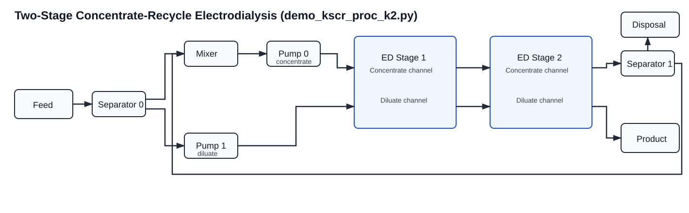

``demo_kscr_proc_k2.py``: Two-Stage Concentrate-Recycle ED Demo
================================================================

Location
--------

``scripts/demos/demo_kscr_proc_k2.py``

Why this demo exists
--------------------

This script demonstrates the staged recirculation process wrapper using a
two-stage ED train. It is the compact example for users who want both:

- stage-wise electrodialysis behavior, and
- a concentrate recycle loop around the full train.

It is the natural staged counterpart to ``demo_oscr_proc.py``.

What physical process is simulated
----------------------------------

The script simulates a **two-stage feed-and-bleed electrodialysis process**:

- feed enters once and is split into a diluate branch and a fresh concentrate
  branch,
- the concentrate branch is mixed with recycled concentrate,
- stage 1 and stage 2 process the stream pair in sequence,
- the final diluate stream becomes product,
- the final concentrate stream is split into:

  - a bleed/disposal stream, and
  - a recycle stream returned to the stage-1 concentrate inlet.

This captures the process behavior of a staged ED train operated with
concentrate recirculation rather than strict single pass.

Model topology behind the script
--------------------------------

The script builds ``KStageConcentrateRecirculation`` with ``num_stages = 2``.
Internally the wrapper creates:

- one shared ``Feed``,
- one upstream ``Separator`` ``sepa0``,
- one recycle ``Mixer`` ``mix0``,
- two shared pumps,
- two ``ED_base`` units under ``fs.EDstack[1].unit`` and
  ``fs.EDstack[2].unit``,
- one downstream ``Separator`` ``sepa1`` for bleed/recycle splitting,
- one product outlet block,
- one disposal outlet block.

See also:

- :doc:`../processes/k_stage_concentrate_recirculation`
- :doc:`../processes/k_stage_single_pass`
- :doc:`../processes/base`
- :doc:`../processes/solution`

Flowsheet layout diagram
------------------------

Core functionality demonstrated
-------------------------------

This demo exercises the main staged-recycle process-layer API:

- ``KStageConcentrateRecirculation(process_cfg=...)``:
  build a stage-indexed recycle flowsheet.
- ``import_init_value_config(...)``:
  apply stage-specific fixed values.
- ``import_scaling_config(...)``:
  apply stage-specific scaling.
- ``set_feed_split_to_diluate(...)``:
  set the upstream split.
- ``set_concentrate_recycle_fraction(...)``:
  set the recycle split.
- ``initialize_process(...)``:
  initialize the full staged recycle flowsheet and solve it.
- ``display_selected_model_metrics(...)``:
  report terminal streams, stage-wise ion treatment, stage-wise electrical
  performance, PT checks, and OCV values.

Input files and what each controls
----------------------------------

The demo uses:

- ``src/electrodialysis_experiment/configs/two_stage_conc_recir.yml``:
  stage-specific process and ED stack setup.
- ``src/electrodialysis_experiment/configs/tscr_init_config.yml``:
  stage-specific initialization and fixed operating values.
- ``src/electrodialysis_experiment/configs/scaling_ts_cc.yml``:
  stage-aware scaling factors.

The script reads ``ed_stack_1`` and ``ed_stack_2`` from YAML and assembles a
typed ``KStageSinglePassConfig`` with ``num_stages=2``.

The feed condition is hardcoded as ``FluidCondition`` and chloride is closed by
electroneutrality.

Execution sequence in the script
--------------------------------

The script performs:

1. Build typed two-stage recycle config from YAML.
2. Build one hardcoded feed condition.
3. Instantiate ``m.proc = KStageConcentrateRecirculation(process_cfg=...)``.
4. Import init-value config.
5. Import scaling config.
6. Set upstream feed split and downstream recycle fraction.
7. Check DOF before initialization.
8. Run ``initialize_process(...)`` to initialize and solve the staged recycle
   process.
9. Print DOF and selected process metrics.

How to run
----------

From repository root:

.. code-block:: bash

   python scripts/demos/demo_kscr_proc_k2.py

Solver/runtime prerequisites are described in ``README.md``.

How to interpret outputs
------------------------

This demo prints more than terminal stream values. The most useful items are:

- feed/product/disposal flow and salinity,
- per-stage diluate outlet and concentrate outlet concentrations,
- per-stage ion removal percentages,
- per-stage voltage and current values,
- pressure and temperature consistency through both stages and the recycle
  loop,
- stage-wise open-circuit voltages.

What to check first:

1. Product salinity should be below feed salinity for a desalting case.
2. Disposal salinity should be above feed salinity.
3. Stage 2 should reflect the propagated stage-1 outlet state.
4. DOF should be 0 at solve time.
5. Solver termination should be optimal.

How this demo connects to the rest of the repo
----------------------------------------------

This demo is the staged recirculation analogue of:

- ``demo_oscr_proc.py`` for one-stage recycle operation, and
- ``demo_kssp_proc_k2.py`` for two-stage single-pass operation.

It is the right starting point when validating:

- k-stage recycle topology,
- stage-indexed YAML paths for recycle flowsheets,
- stage-wise current and OCV settings with recycle,
- feed-and-bleed closure choices for staged ED systems.

Common customization paths
--------------------------

Typical user modifications include:

1. changing feed composition or flow in the hardcoded ``FluidCondition``,
2. modifying per-stage stack config in ``two_stage_conc_recir.yml``,
3. changing stage-specific current, OCV, pressure-drop, or transport settings
   in ``tscr_init_config.yml``,
4. adjusting scaling in ``scaling_ts_cc.yml``,
5. changing the closure strategy between water recovery and recycle fraction.

For YAML format details, see :doc:`../utils/yaml_configuration_guide`.
