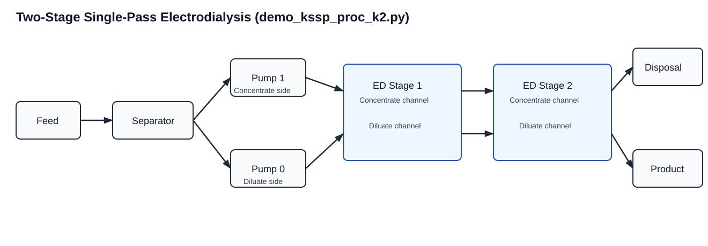

``demo_kssp_proc_k2.py``: Two-Stage Single-Pass ED Demo
========================================================

Location
--------

``scripts/demos/demo_kssp_proc_k2.py``

Why this demo exists
--------------------

This script demonstrates the staged-process capability of the repository using
the ``KStageSinglePass`` wrapper with ``num_stages = 2``. It shows how to run a
coupled multi-stage ED process while still keeping the workflow compact and
easy to inspect.

It is the clearest example of how the process modules support stage-aware model
construction beyond a single stack.

What physical process is simulated
----------------------------------

The script simulates a **two-stage single-pass electrodialysis train**:

- feed enters once and is split into diluate/concentrate sides,
- stage 1 ED unit performs first separation,
- stage 1 outlets are propagated to stage 2 inlets,
- stage 2 further processes the stream pair,
- final product and disposal streams are collected.

Compared with one-stage, this captures stage-wise operating behavior and
inter-stage coupling, which is important when one stack is insufficient for the
target separation.

Model topology behind the script
--------------------------------

The script builds ``KStageSinglePass`` with a stage set of size 2. Internally:

- one shared ``Feed``, ``Separator``, and two ``Pump`` blocks are created,
- one ``ED_base`` unit per stage is created under ``fs.EDstack[stage].unit``,
- inter-stage arcs connect stage 1 outlets to stage 2 inlets,
- shared product/disposal outlet blocks terminate the train.

See also:

- :doc:`../processes/k_stage_single_pass`
- :doc:`../processes/base`
- :doc:`../processes/solution`

Flowsheet layout diagram
------------------------

Core functionality demonstrated
-------------------------------

This demo is a compact showcase of the staged-process API:

- ``KStageSinglePassConfig`` assembly for stage-specific ED stack settings.
- ``KStageSinglePass(process_cfg=...)``:
  flowsheet construction with stage set and stage-indexed stack blocks.
- ``import_init_value_config(...)`` with stage-indexed targets:
  fixed-value setup for multi-stage variables.
- ``import_scaling_config(...)`` with stage-indexed targets:
  stage-aware numerical conditioning.
- ``initialize_process(...)``:
  ordered initialization across shared upstream units, stage 1, inter-stage
  propagation, stage 2, and terminal units, followed by full solve.
- ``display_selected_model_metrics(...)``:
  stage-coupled process performance inspection.

These methods are the core of the package's ability to represent and solve
coupled ED stage trains from reusable configuration files.

Input files and what each controls
----------------------------------

The demo uses:

- ``src/electrodialysis_experiment/configs/two_stage_single_pass.yml``:
  defines per-stage ED stack config blocks and shared ion/solution/process/ipopt
  sections.
- ``src/electrodialysis_experiment/configs/tssp_init_config.yml``:
  stage-indexed initialization/fixed values.
- ``src/electrodialysis_experiment/configs/scaling_tssp.yml``:
  stage-indexed scaling factors.

The script constructs a typed config by reading ``ed_stack_1`` and
``ed_stack_2`` and mapping them into ``KStageSinglePassConfig`` with
``num_stages=2``.

The feed condition is hardcoded as ``FluidCondition`` (with chloride closed by
electroneutrality).

Execution sequence in the script
--------------------------------

The script performs:

1. Build typed two-stage process config from YAML.
2. Build one hardcoded feed condition.
3. Instantiate ``m.proc = KStageSinglePass(process_cfg=...)``.
4. Import init-value config.
5. Import scaling config.
6. Check DOF before initialization/solve.
7. Run ``initialize_process(...)``:
   initializes upstream units, stage 1, propagates to stage 2, initializes stage
   2, then solves coupled flowsheet.
8. Print DOF and selected process metrics.

How to run
----------

From repository root:

.. code-block:: bash

   python scripts/demos/demo_kssp_proc_k2.py

Solver/runtime prerequisites are described in ``README.md``.

How to interpret outputs
------------------------

In addition to stream metrics, stage-aware quantities are key:

- stage-specific voltage/current behavior,
- stage-specific OCV/current density effects,
- combined product/disposal quality after stage coupling.

What to check first:

1. Product salinity trend vs feed (should improve for desalting cases).
2. Stage-level operating metrics (voltage/OCV/current consistency).
3. DOF at solve time.
4. Solver termination.

How this demo connects to the rest of the repo
----------------------------------------------

This demo is the staged counterpart to the OSSP demo and connects directly to:

- ``scripts/run_proc_tssp.py``:
  data-driven two-stage runs with row-wise stage updates from schema helpers.
- ``tests/processes/test_k_stage_single_pass.py``:
  regression checks for k-stage process behavior.
- experiment/training workflows where staged process models may be embedded in
  broader pipelines.

Use this demo when validating stage coupling, stage-indexed YAML paths, and
multi-stage initialization behavior before using larger data-driven workflows.

Common customization paths
--------------------------

Typical user modifications:

1. Change hardcoded feed condition.
2. Modify ``two_stage_single_pass.yml`` stage configs independently.
3. Add or adjust stage-specific initialization/scaling entries.
4. Extend to more stages by using ``KStageSinglePassConfig.num_stages`` with
   ``ed_stacks`` overrides.
5. Add stage-specific variable updates (for example, voltage/current constraints)
   using process helper methods used in ``run_proc_tssp.py``.

For YAML format details, see :doc:`../utils/yaml_configuration_guide`.
