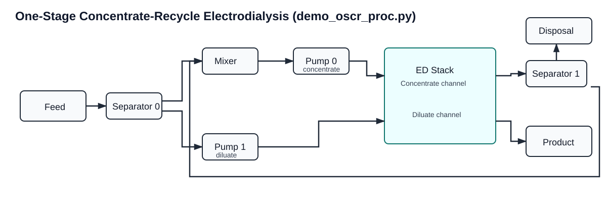

``demo_oscr_proc.py``: One-Stage Concentrate-Recycle ED Demo
============================================================

Location
--------

``scripts/demos/demo_oscr_proc.py``

Why this demo exists
--------------------

This script demonstrates the smallest complete process simulation in this
repository that includes a concentrate recycle loop. It is intended to show
how to:

1. build a concentrate-recycle process model from YAML configuration,
2. apply scaling and initialization YAMLs,
3. provide one feed condition,
4. choose a recycle-oriented closure strategy, and
5. initialize and solve the flowsheet.

It stays intentionally small so the feed-and-bleed process logic is easy to
inspect without the overhead of data-ingestion or experiment-loop code.

What physical process is simulated
----------------------------------

The script simulates a **one-stage electrodialysis process with concentrate
recirculation**:

- one feed stream enters the process,
- part of the feed is routed toward the diluate side and part toward the
  concentrate side,
- the electrodialysis stack removes ions from the diluate stream under an
  applied voltage,
- the final concentrate stream is split into:

  - a bleed/disposal stream, and
  - a recycle stream returned to the concentrate inlet.

This is a feed-and-bleed ED configuration. It is useful when water recovery
must be controlled while still maintaining a recirculating concentrate loop.

Model topology behind the script
--------------------------------

The script calls ``OneStageConcentrateRecirculation.from_yaml(...)``. The
process wrapper creates and connects:

- ``Feed``,
- ``Separator`` ``sepa0``,
- ``Mixer`` ``mix0``,
- two ``Pump`` blocks,
- one ``ED_base`` stack unit,
- ``Separator`` ``sepa1``,
- ``Product`` and disposal ``Product`` outlet blocks.

See also:

- :doc:`../processes/one_stage_concentrate_recirculation`
- :doc:`../processes/one_stage_single_pass`
- :doc:`../processes/base`
- :doc:`../processes/solution`

Flowsheet layout diagram
------------------------

Core functionality demonstrated
-------------------------------

This demo directly exercises the recirculation-specific process-layer hooks:

- ``OneStageConcentrateRecirculation.from_yaml(...)``:
  schema-validated process construction.
- ``import_scaling_config(...)``:
  numerical scaling setup.
- ``import_init_value_config(...)``:
  reproducible design and operating values.
- ``set_feed_split_to_diluate(...)``:
  set the first separator split.
- ``set_concentrate_recycle_fraction(...)``:
  set the recycle split without necessarily fixing it.
- ``initialize_process(...)``:
  recycle-aware staged initialization and solve.
- ``display_selected_model_metrics(...)``:
  process KPI reporting.

Input files and what each controls
----------------------------------

The demo uses three YAML files:

- ``src/electrodialysis_experiment/configs/one_stage_conc_recir.yml``:
  process and stack configuration.
- ``src/electrodialysis_experiment/configs/scaling.yml``:
  numerical scaling factors.
- ``src/electrodialysis_experiment/configs/oscr_init_config.yml``:
  initialization values and fixed operating/design quantities.

The feed condition is hardcoded in the script as a ``FluidCondition`` object
and chloride is closed by electroneutrality:

``Cl_- = Na_+ + 2*Ca_2+ + 2*Mg_2+``

Execution sequence in the script
--------------------------------

The script performs:

1. Build one hardcoded feed condition via ``build_demo_fluid_condition()``.
2. Instantiate ``m.proc = OneStageConcentrateRecirculation.from_yaml(...)``.
3. Import scaling config.
4. Import init-value config.
5. Set initial values for the feed split and recycle split.
6. Run ``initialize_process(...)``.
7. Print process metrics using ``display_selected_model_metrics(...)``.

How to run
----------

From repository root:

.. code-block:: bash

   python scripts/demos/demo_oscr_proc.py

Solver/runtime prerequisites are described in ``README.md``. In this project,
``ipopt-watertap`` is the intended default solver path for robust ED solves.

How to interpret outputs
------------------------

The printed summary reports:

- feed, product, and disposal flow and salinity,
- ion concentrations in the key terminal streams,
- electrical and design values for the stack, and
- pressure/temperature checks around the recycle loop.

What to check first:

1. Product salinity should typically be lower than feed salinity.
2. Disposal salinity should typically be higher than feed salinity.
3. DOF should be 0 at solve time.
4. Solver termination should be optimal or locally optimal.
5. Recovery, recycle split, and bleed behavior should be consistent with the
   chosen operating condition.

How this demo connects to the rest of the repo
----------------------------------------------

This demo is the recirculation-process counterpart to the single-pass demo. It
is the right starting point when debugging:

- recycle-loop closure choices,
- water-recovery-controlled ED operation,
- recirculation-specific initialization behavior, or
- YAML settings for the concentrate-recycle flowsheet.

Common customization paths
--------------------------

To adapt this demo for another one-stage recycle scenario:

1. Change feed composition/flow in ``build_demo_fluid_condition()``.
2. Modify stack and process configuration in ``one_stage_conc_recir.yml``.
3. Tune initialization in ``oscr_init_config.yml``.
4. Tune scaling in ``scaling.yml``.
5. Choose whether to control water recovery or recycle split as the main
   closure variable.

For YAML authoring details, see :doc:`../utils/yaml_configuration_guide`.
