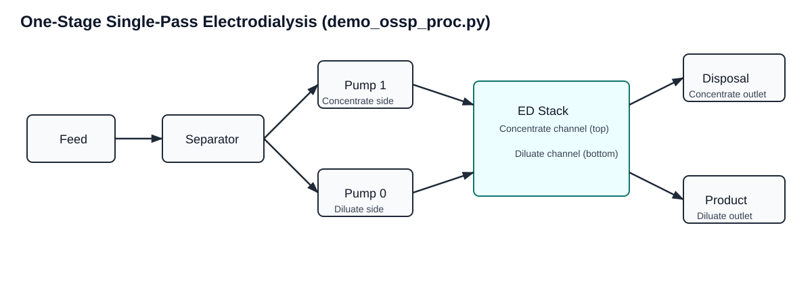

``demo_ossp_proc.py``: One-Stage Single-Pass ED Demo
=====================================================

Location
--------

``scripts/demos/demo_ossp_proc.py``

Why this demo exists
--------------------

This script is the smallest complete process-simulation example for this
repository. It is intended to demonstrate how to:

1. build a process model from YAML configuration,
2. apply user scaling and initialization YAMLs,
3. provide one feed condition, and
4. initialize and solve the flowsheet.

It deliberately avoids parquet-table ingestion and experiment-loop machinery so
the process-model behavior is easier to see.

What physical process is simulated
----------------------------------

The script simulates a **single-stage, single-pass electrodialysis (ED)**
process:

- one feed stream enters once (single-pass),
- the feed is split to diluate and concentrate channels,
- ions are transported through ion-exchange membranes under an electric field,
- one product stream (lower salinity) and one disposal/brine stream are
  produced.

In practical terms, this is a baseline desalting/selective-ion-removal
simulation with one ED stack.

Model topology behind the script
--------------------------------

The script calls ``OneStageSinglePass.from_yaml(...)``. The process wrapper
creates and connects:

- ``Feed``,
- ``Separator`` (diluate-side vs concentrate-side inlet split),
- ``Pump`` blocks (one per side),
- one ``ED_base`` stack unit,
- ``Product`` and disposal ``Product`` outlet blocks.

The wrapper also adds process-level expressions and helper methods for solve,
reporting, and plotting.

See also:

- :doc:`../processes/one_stage_single_pass`
- :doc:`../processes/base`
- :doc:`../processes/solution`

Flowsheet layout diagram
------------------------

Core functionality demonstrated
-------------------------------

This demo directly exercises core process-module capabilities:

- ``OneStageSinglePass.from_yaml(...)``:
  schema-validated process construction from external YAML.
- ``import_scaling_config(...)``:
  model conditioning through user-managed scaling rules.
- ``import_init_value_config(...)``:
  reproducible fixed/initial variable state from YAML.
- ``initialize_process(...)``:
  sequential unit initialization, arc state propagation, and full-process solve.
- ``solve(...)`` fallback path:
  process-level solve entry point using configured/default solver.
- ``display_selected_model_metrics(...)``:
  quick process KPI reporting for feed/product/disposal behavior.

These are the same process-layer hooks used by higher-level workflows such as
data-driven runs and training pipelines.

Input files and what each controls
----------------------------------

The demo uses three YAML files:

- ``src/electrodialysis_experiment/configs/one_stage_single_pass.yml``:
  process and stack configuration (operation mode, discretization, ion system,
  solver-name defaults).
- ``src/electrodialysis_experiment/configs/scaling.yml``:
  numerical scaling factors for properties/components/constraints.
- ``src/electrodialysis_experiment/configs/ossp_init_config.yml``:
  initial/fixed variable values (design and operating values).

The feed condition is hardcoded in the script as a ``FluidCondition`` object
and includes electroneutrality closure for chloride:

``Cl_- = Na_+ + 2*Ca_2+ + 2*Mg_2+``.

Execution sequence in the script
--------------------------------

The script performs:

1. Build hardcoded feed condition via ``build_demo_fluid_condition()``.
2. Instantiate ``m.proc = OneStageSinglePass.from_yaml(...)``.
3. Import scaling config.
4. Import init-value config.
5. Check degrees of freedom before solve.
6. Run ``initialize_process(...)``:
   this internally initializes each unit in sequence, propagates states across
   arcs, and solves the full flowsheet.
7. Print process metrics using ``display_selected_model_metrics(...)``.

How to run
----------

From repository root:

.. code-block:: bash

   python scripts/demos/demo_ossp_proc.py

Solver/runtime prerequisites are described in ``README.md``. In this project,
``ipopt-watertap`` is the intended default solver path for robust ED solves.

How to interpret outputs
------------------------

The printed summary is process-level and unit-level context combined:

- flow and salinity in feed/product/disposal,
- ionic concentrations in key streams,
- electrical/operating quantities derived by the process wrapper.

What to check first:

1. Product salinity should typically be below feed salinity for desalting cases.
2. Disposal salinity should typically be above feed salinity.
3. DOF should be 0 at solve time.
4. Solver termination should be optimal or locally optimal.

How this demo connects to the rest of the repo
----------------------------------------------

This demo is the process-level foundation for heavier workflows:

- ``scripts/run_proc_ossp.py``:
  data-driven one-stage runs (reads parquet, stage updates from schema helpers).
- ``scripts/model_training.py``:
  experiment-level surrogate training over many samples.
- ``tests/processes/test_one_stage_single_pass.py``:
  regression check that one-stage process solve remains stable.

Use this demo first when debugging model setup, scaling, solver setup, or YAML
configuration semantics before moving to full training/validation workflows.

Common customization paths
--------------------------

To adapt this demo for your own scenario:

1. Change feed composition/flow in ``build_demo_fluid_condition()``.
2. Modify operation mode and stack configuration in
   ``one_stage_single_pass.yml``.
3. Tune initialization in ``ossp_init_config.yml``.
4. Tune scaling in ``scaling.yml``.
5. Optionally add post-solve profile plots through
   ``plot_lengthwise_profile(...)`` methods.

For YAML authoring details, see :doc:`../utils/yaml_configuration_guide`.
